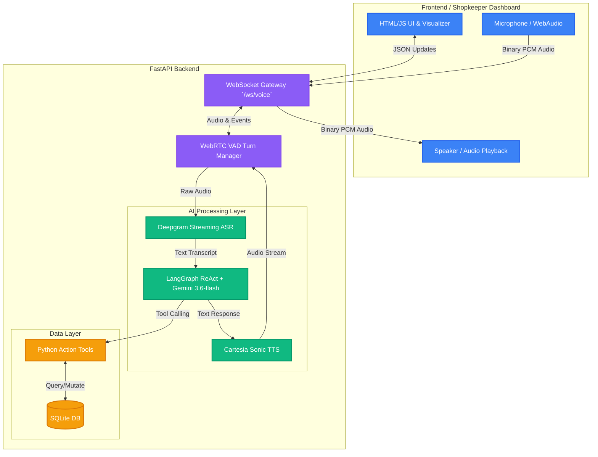

# Enry Voice OS 🎙️

A real-time, hands-free, multilingual Voice OS that transforms natural Kannada/Hindi/English speech into structured inventory, billing, and khata ledger actions for Indian SMBs (Small and Medium Businesses).

## 📋 Table of Contents
- [Overview](#overview)
- [Architecture](#architecture)
- [Features](#features)
- [Tech Stack](#tech-stack)
- [Setup & Installation](#setup--installation)
- [Project Structure](#project-structure)
- [Voice Command Examples](#voice-command-examples)
- [Contributing](#contributing)

---

## 🎯 Overview

Enry Voice OS is designed to simplify retail and SMB operations through real-time conversational AI. Shopkeepers and business owners can manage their inventory, create bills, track customer credit (khata), and generate daily summaries—all hands-free using natural speech.

### Key Benefits:
- **Real-Time Voice Pipeline**: Instant streaming ASR and TTS with millisecond latency.
- **Hands-Free Operation**: Voice Activity Detection (VAD) handles conversational turn-taking naturally.
- **Multilingual Support**: Supports Kannada, Hindi, and English out of the box.
- **Digital Khata**: Replace paper ledgers with automated credit tracking.
- **POS Integration**: Quick billing and checkout operations.

---

## 🏗️ Architecture



### Component Overview

**Frontend (`/static`)**
- Modern HTML/CSS/JavaScript interface tailored for Shopkeepers.
- Native MediaRecorder and WebAudio integration for real-time capture and playback.
- WebSocket-based bidirectional communication.

**Voice Gateway (`voice/gateway.py`)**
- Handles active WebSocket connections.
- Manages audio chunk sequence and routes it to the Turn Manager.

**Turn Management (`voice/turn_manager.py`)**
- Implements WebRTC VAD to detect speech start and end.
- Handles human barge-in interrupts gracefully.
- Orchestrates STT, Agent, and TTS layers.

**AI & Agents (`agent/` & `voice/`)**
- **Deepgram Nova-3**: Real-time Kannada/Hindi speech-to-text.
- **LangGraph**: ReAct agent architecture with tool-calling capabilities.
- **Google Gemini**: The core LLM processing conversational logic.
- **Cartesia Sonic**: Low-latency, ultra-realistic text-to-speech.

**Database (`db.py`)**
- SQLite schema management.
- Transaction-safe operations for inventory and khata.

---

## ✨ Features

### Voice Commands Supported
- **Billing**: "Ek packet biscuit add karo"
- **Khata Management**: "Ramesh ko 500 rupees credit de"
- **Stock Checking**: "Chai ka stock dekh"
- **Payment Recording**: "Priya ne 1000 payment kiya"
- **Kannada Support**: "ರಮೇಶ್ ಅವರ ಐವತ್ತು ರೂಪಾಯಿ ಉದಾಲಿಕೋ" (Write 50 rupees udhaar for Ramesh)

### Core Functionalities
✅ Full Duplex Voice Streaming  
✅ Automatic Barge-in Detection  
✅ Multi-step ReAct Agent Tool Execution  
✅ Customer management  
✅ Inventory tracking  
✅ Khata ledger (credit tracking)  
✅ Live DB Visualizer on Frontend  

---

## 🛠️ Tech Stack

| Layer | Technology | Purpose |
|-------|-----------|---------|
| **Frontend** | Vanilla JS, HTML, CSS | Real-time Dashboard |
| **Backend** | FastAPI, Uvicorn | WebSockets & REST API |
| **Agent Logic** | LangGraph, LangChain | Workflow Orchestration |
| **Database** | SQLite3 | Local Storage |
| **STT** | Deepgram (Nova-3) | Streaming Audio-to-Text |
| **TTS** | Cartesia (Sonic) | Streaming Text-to-Speech |
| **LLM** | Google Gemini (3.6-flash) | NLU & Tool Selection |
| **VAD** | WebRTC VAD | Voice Activity Detection |

---

## 🚀 Setup & Installation

### Prerequisites
- Python 3.10+
- `pip`
- Git

### API Keys Required
- **Deepgram API Key** (for ASR)
- **Google Gemini API Key** (for LLM)
- **Cartesia API Key** (for TTS)

### Step 1: Clone the Repository
```bash
git clone https://github.com/Imkumar80/Enry-BoL.git
cd Enry-BoL
```

### Step 2: Setup Environment
```bash
python3 -m venv venv
source venv/bin/activate
pip install -r requirements.txt
```

### Step 3: Configure Environment Variables
Create a `.env` file in the root directory:
```env
GEMINI_API_KEY="your-gemini-key"
GEMINI_MODEL="gemini-3.6-flash"

DEEPGRAM_API_KEY="your-deepgram-key"

CARTESIA_API_KEY="your-cartesia-key"
CARTESIA_VOICE_ID="3b554273-4299-48b9-9aaf-eefd438e3941"

PORT=8000
HOST=127.0.0.1
```

### Step 4: Run the Application
```bash
python app.py
```
Open `http://127.0.0.1:8000` in your browser.

---

## 📁 Project Structure

```
Enry-BoL/
├── app.py                    # FastAPI entrypoint
├── db.py                     # SQLite database definitions
├── requirements.txt          # Python dependencies
├── static/                   # Frontend assets
│   ├── index.html            # Shopkeeper Dashboard
│   ├── app.js                # WebAudio & WebSocket client
│   └── styles.css            # UI Styling
├── agent/                    # LangGraph AI Logic
│   ├── graph.py              # ReAct Agent compilation
│   ├── llm.py                # Gemini LLM Initialization
│   └── tools.py              # Python tools (Khata/Inventory)
├── voice/                    # Real-time Voice Pipeline
│   ├── gateway.py            # WebSocket Server
│   ├── turn_manager.py       # VAD & Turn Orchestrator
│   ├── asr.py                # Deepgram Streaming Client
│   └── tts.py                # Cartesia Streaming Client
└── test_audio/               # Utilities and benchmarks
```

---

**Made with ❤️ for Indian SMBs**

*Transforming retail operations one real-time conversation at a time.*
